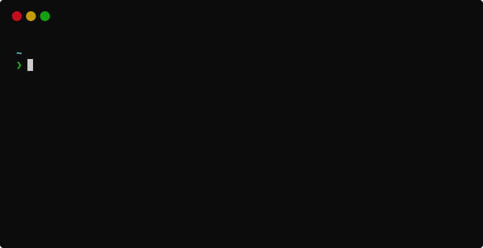

# Collaboration

This project uses a novel methodology for development, in which you only need [Docker installed](https://docs.docker.com/install/).
Fork the project, clone, and you'll find a `dockerfile` and a `docker-compose.yml` file in the project root.
We provide a [packaged testing environment](https://hub.docker.com/autogoal/autogoal) in the form of a Docker image with all the development tools installed and configured, e.g., testing libraries, etc.
There is also a `makefile` with all the necessary commands.

The workflow is something like this:

1. Fork and clone the project.
    - If you have not already, consider installing [Github CLI](https://cli.github.com).
2. Run `make pull` to get the development image or `make docker` if you prefer to build it from scratch (somewhat slow).
3. Develop:
    - If you are using Visual Studio Code with Remote Extensions (recommended) when you open the project it will recommend you to launch the remote container. This is the most comfortable environment to develop for AutoGOAL since everything is preconfigured.
    - Otherwise, pick your poison (ehem, editor) and edit.
4. Run `make shell` to open a local shell inside the development container at any moment.
5. Run `make test-core` **inside** the development container and make sure everything passes.
    - You can also run `make test-full` to run the full set of tests. This is very slow and only necessary when making a new release.
    - You can also run `make test-ci` **outside** the development container. This will build a slim container with just the core dependencies and run the core tests. This is the most similar testing environment to the Github CI, so make sure this works as well.
    - Remember to add new tests if necessary.
6. Run `make format` to reformat all code after all tests pass.
7. If all worked, push to your own fork and open a pull-request.

Here is a quick visual summary.

This project uses [poetry](https://python-poetry.org/) for package management. If you need to install new dependencies, run `make shell` and then `poetry ...` inside the dockerized environment. Finally, don't forget to `poetry lock` and commit the changes to `pyproject.toml` and `poetry.lock` files.

## License

License is MIT, so you know the drill: fork, develop, test, pull request, rinse and repeat.

> MIT License
>
> Copyright (c) 2019-2020 - AutoGOAL contributors
>
> Permission is hereby granted, free of charge, to any person obtaining a copy
> of this software and associated documentation files (the "Software"), to deal
> in the Software without restriction, including without limitation the rights
> to use, copy, modify, merge, publish, distribute, sublicense, and/or sell
> copies of the Software, and to permit persons to whom the Software is
> furnished to do so, subject to the following conditions:
>
> The above copyright notice and this permission notice shall be included in all
> copies or substantial portions of the Software.
>
> THE SOFTWARE IS PROVIDED "AS IS", WITHOUT WARRANTY OF ANY KIND, EXPRESS OR
> IMPLIED, INCLUDING BUT NOT LIMITED TO THE WARRANTIES OF MERCHANTABILITY,
> FITNESS FOR A PARTICULAR PURPOSE AND NONINFRINGEMENT. IN NO EVENT SHALL THE
> AUTHORS OR COPYRIGHT HOLDERS BE LIABLE FOR ANY CLAIM, DAMAGES OR OTHER
> LIABILITY, WHETHER IN AN ACTION OF CONTRACT, TORT OR OTHERWISE, ARISING FROM,
> OUT OF OR IN CONNECTION WITH THE SOFTWARE OR THE USE OR OTHER DEALINGS IN THE
> SOFTWARE.
